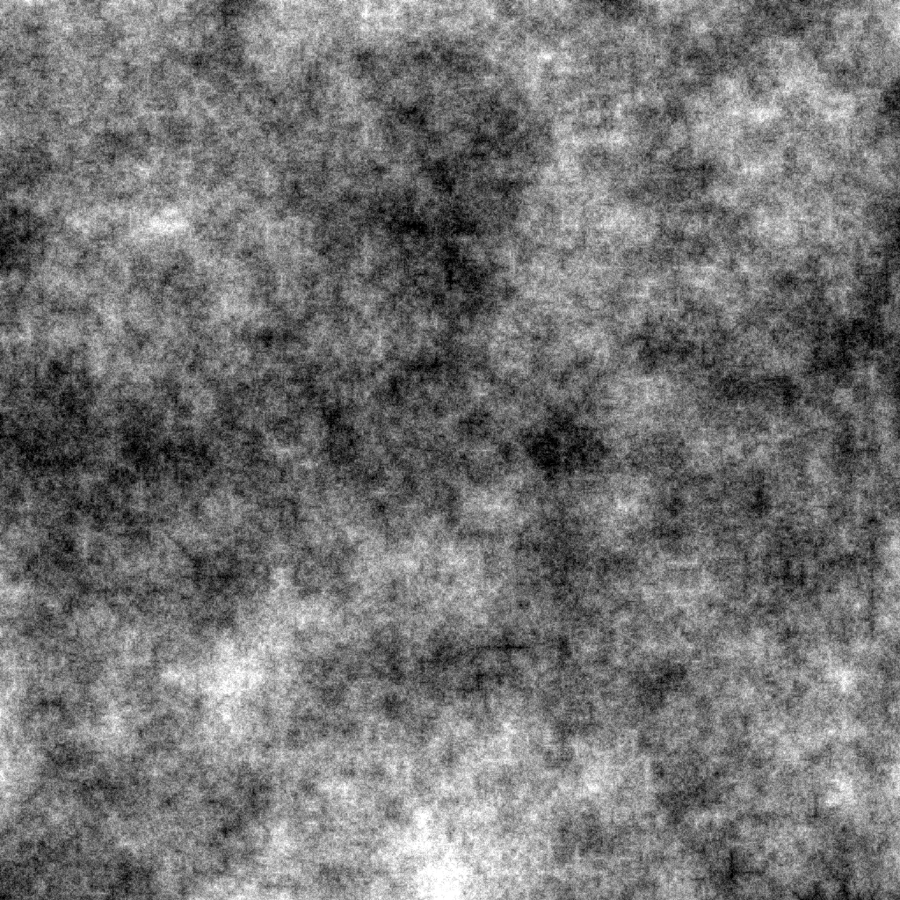

# Perlin Noise Generator

This code is based on http://freespace.virgin.net/hugo.elias/models/m_perlin.htm

It generates an image of 2D perlin noise using several threads, then saves the result as png.

## Configure

Run `sudo apt install build-essential libpng-dev`

## Make

Run `make`

## Run

First make, then run `./makeimage`

## Output

